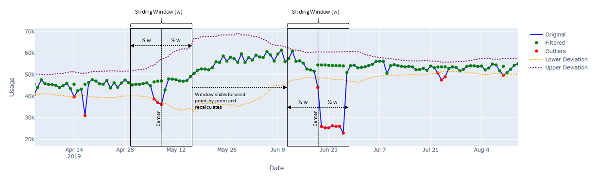
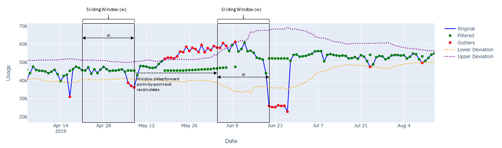

# pyhampel

This package implements Hampel filter for time series data.  
 

### What is a Hampel Filter?
The Hampel filter is an algorithm that uses median absolute deviation (MAD) and a sliding window to detect outliers and replace them with rolling median values. 

### What Are Uses For Hampel Filters?
-   Detecting outliers.
-   Filter noisy data by replacing outliers with median.

### How Does it Work?
For each point, a median and standard deviation are calculated using all neighboring values within a window of size, w.  If the point of interest lies outside of a specified number of standard deviations from the median it is flagged as an outlier. 

 

#### Hampel Filter With Window Centered

-   For each time step, the median of the points in the window is calculated, resulting in a rolling median set of points.
-   Also, for each time step, the median absolute deviation is calculated, resulting in a rolling median absolute deviation set of points.
-   Using a scaling factor to estimate standard deviation based on MAD, we calculate a number of deviations from the rolling median.  If the original point falls outside of the range of the median +/- deviation, then it is an outlier and the filtered value is the rolling median value calculated earlier.
-   In this particular case, the rolling window is centered on the point being evaluated with points to the left and right of center used in the calculation.

 

#### Hampel Filter With Point on Leading Edge
This option is more sensitive to changes in value from one period to the next.

-   For each time step, the median of the points in the window is calculated, resulting in a rolling median set of points.
-   Also, for each time step, the median absolute deviation is calculated, resulting in a rolling median absolute deviation set of points.
-   Using a scaling factor to estimate standard deviation based on MAD, we calculate a number of deviations from the rolling median.  If the original point falls outside of the range of the median +/- deviation, then it is an outlier and the filtered value is the rolling median value calculated earlier.
-   In this particular case, the leading edge of the rolling window is on the point being evaluated with points to the left used in the calculation.

### Window Size and Standard Devation?
There is no universal window size or threshold to use.  The window size and threshold will need to be determined based on the characteristics of the data and the application of the Hampel filter.

### How do I use it?

Input a dataframe with time series data and pyhampel will generate a new dataframe that adds columns for filtered data, outlier values, and a boolean flag indicating if a data point is an outlier.

